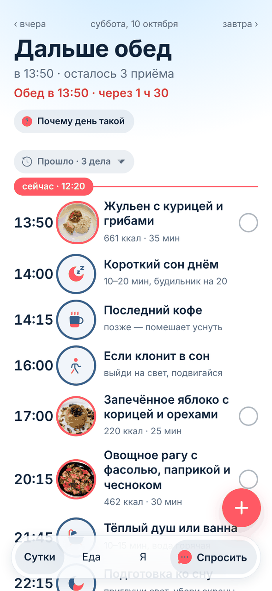
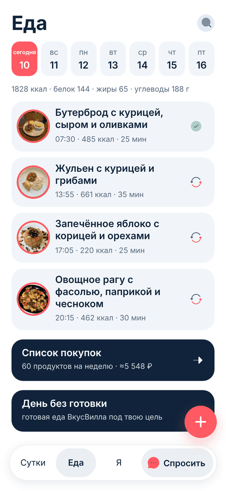
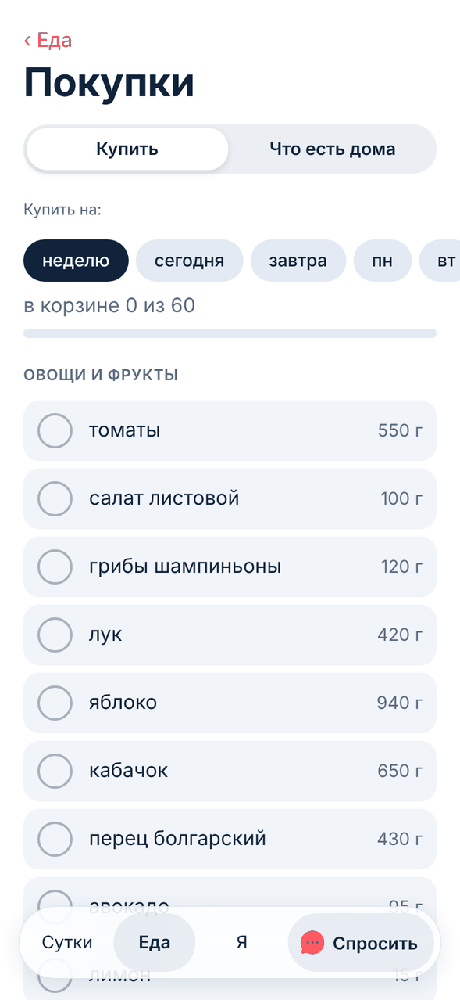
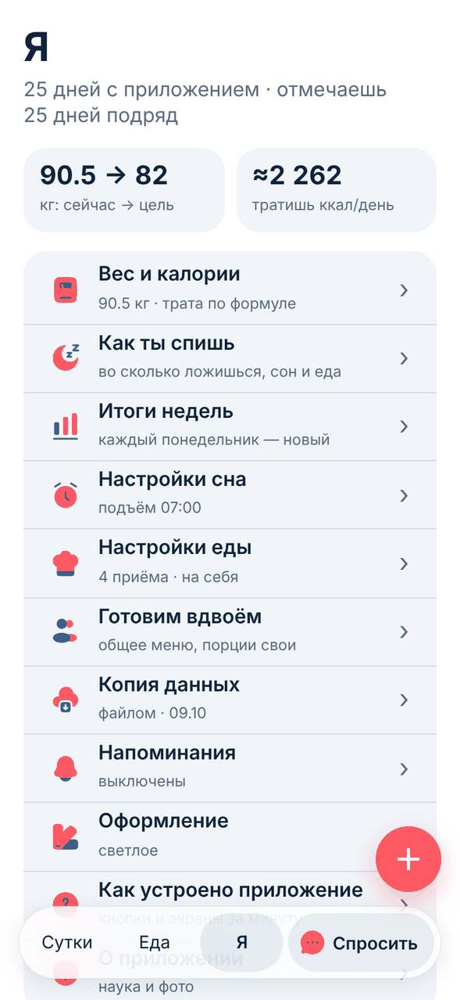
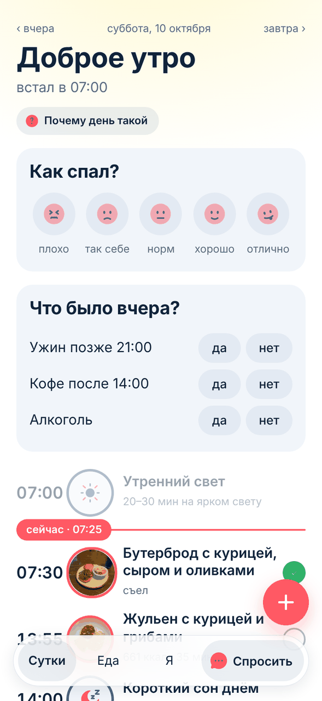
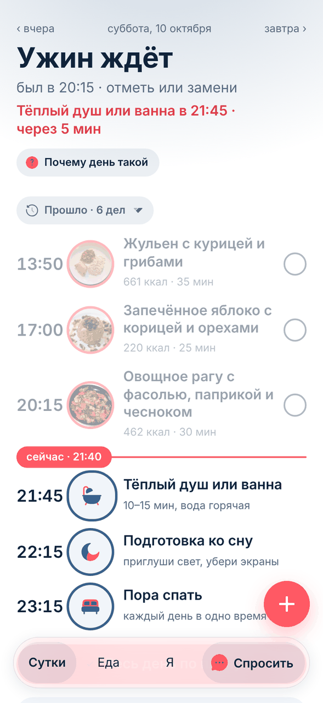
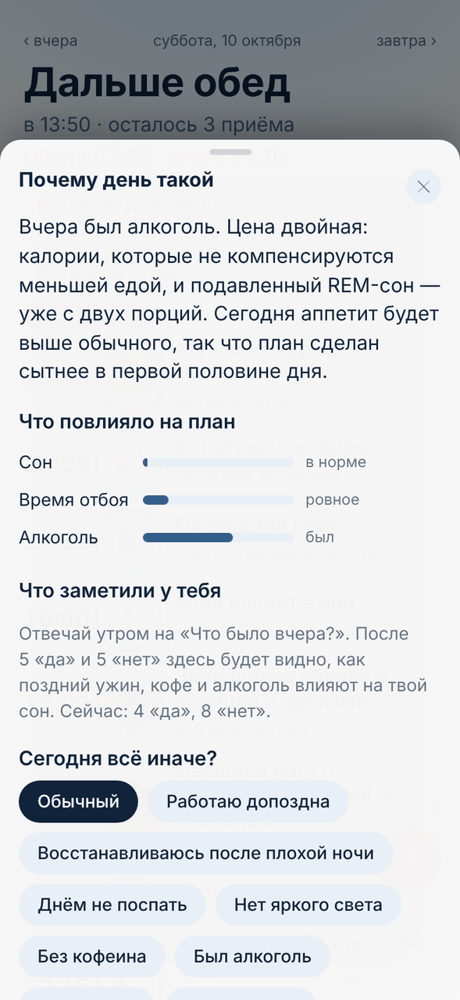
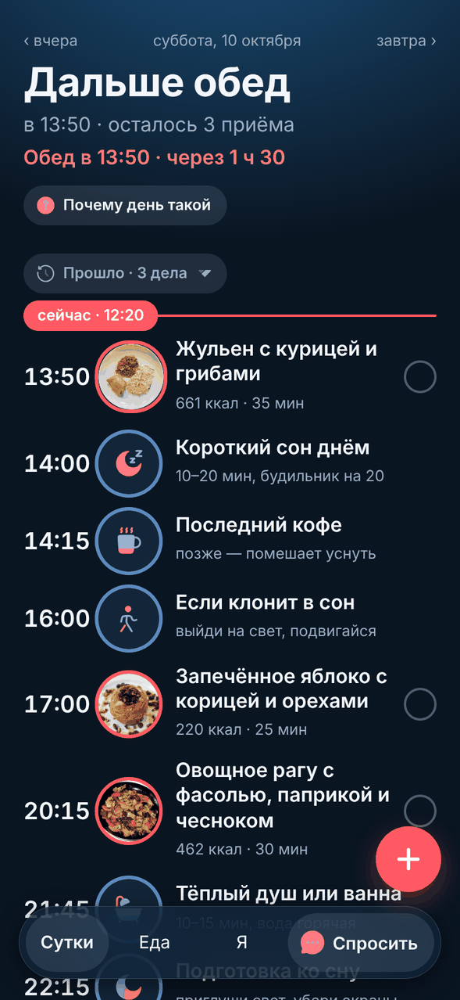
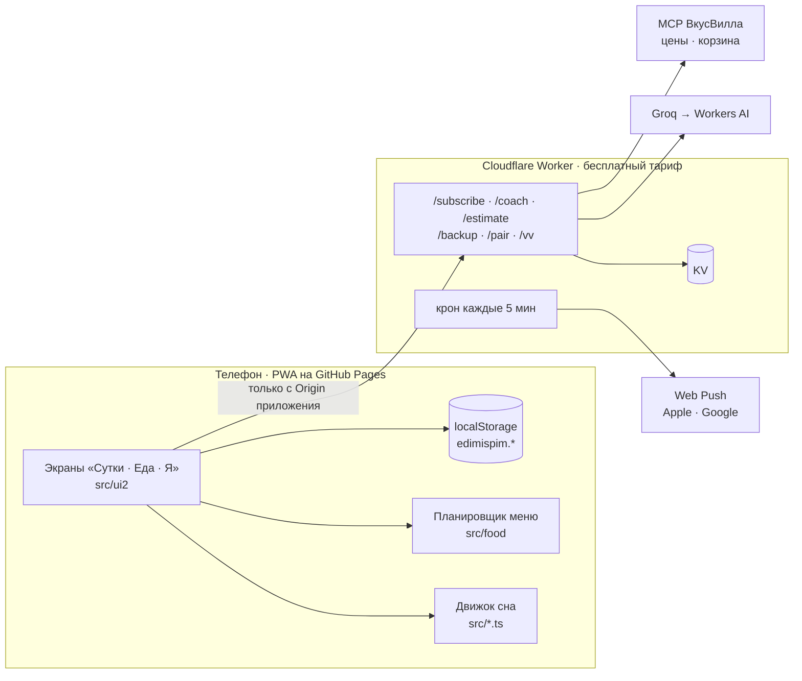

<p align="center">
  
</p>

<h1 align="center">edim &amp; spim</h1>

<p align="center">
  <b>Сон и питание как одни сутки.</b><br>
  Бесплатное приложение для iPhone и Android: утром говорит, как прожить день после <i>такой</i> ночи,<br>
  днём ведёт по меню под твою цель, вечером напоминает, когда закругляться.
</p>

<p align="center">
  <a href="https://iserdario-tech.github.io/edimispim/"><b>Открыть приложение</b></a> ·
  <a href="#установить-на-телефон">Установить</a> ·
  <a href="docs/FAQ.md">Вопросы и ответы</a> ·
  <a href="docs/ARCHITECTURE.md">Как устроено</a> ·
  <a href="LAB.md">Журнал разработки</a>
</p>

<p align="center">
  <a href="https://github.com/iserdario-tech/edimispim/actions/workflows/deploy.yml"></a>
  
  
  
  
  
</p>

<p align="center">
  
  
  
  
</p>

---

## Зачем

Приложений про сон много, про еду ещё больше. Но ни одно из них не знает, что **недосып поднимает аппетит примерно на 250 ккал в день** и роняет самоконтроль, а поздний тяжёлый ужин крадёт сон. Это одни и те же сутки, и вести их нужно вместе.

edim & spim вырос из двух отдельных приложений: **pospat** (сон) и **oheedet** (еда). Когда стало ясно, что половину пользы они теряют именно на стыке, их склеили в одно. Отсюда и название: *едим и спим*.

Что получилось:

- **Один экран на день.** Открыл, за три секунды понял, что сейчас и что дальше, сделал одно действие, закрыл.
- **План сна подстраивает еду, еда подстраивает сон.** После плохой ночи меню становится проще, но калории те же. Ужин стоит так, чтобы не мешать засыпанию.
- **Честная рамка.** Никаких баллов, красного цвета и «ты молодец». Оценки со знаком «≈», наука со ссылками, наблюдения вместо выводов.
- **Бесплатно и без аккаунтов.** Данные живут на телефоне. Копия в облаке зашифрована так, что прочитать её не можем даже мы.

## Как проходит день

| Время | Что делает приложение |
|---|---|
| **Утро** | «Доброе утро · встал в 07:00». Один тап: как спал? Три вопроса: был ли вчера поздний ужин, кофе после 14:00, алкоголь. Из этого собирается день. |
| **День** | Лента суток: завтрак с фото, утренний свет, обед, короткий сон днём, последний кофе, сладкое, ужин. Заголовок говорит, что дальше: «Дальше обед · в 13:50 · осталось 3 приёма». Тап по тарелке — рецепт; свайп — «съел» или «своё». |
| **Вечер** | «Ужин ждёт · отметь или замени». Тёплый душ за полтора часа до сна, подготовка ко сну за час, «Пора спать · каждый день в одно время». Небо на экране темнеет. |
| **Понедельник** | История недели слайдами: сон, еда, вес, что заметили, что дальше. Можно поделиться картинкой. |

<p align="center">
  
  
  
  
</p>

## Что умеет

### 🌙 Сон

- **План дня из доказанных окон**: утренний свет в первый час, последний кофе (за 9 часов до отбоя при обычной дозе и за 13 при большой, по мета-анализу Sleep Med Rev 2023), короткий сон 10–20 минут через 6–8 часов после подъёма, тёплый душ за 90 минут, подготовка ко сну за час, отбой под цель сна.
- **Режимы дня**: обычный, «работаю допоздна» (отбой через полчаса после конца работы, завтра отсыпаться), «восстанавливаюсь после плохой ночи». Переключатели: нет яркого света, не поспать днём, без кофеина, был алкоголь.
- **Слово дня** вместо баллов: «Доброе утро», «Дальше обед», «Лёгкий день», «Пора закругляться». Описывает план, а не оценивает человека.
- **«Что было вчера?» и личный эффект**: после пяти «да» и пяти «нет» приложение показывает, как поздний ужин, кофе или алкоголь сказываются именно на тебе. Как наблюдение, без процентов.
- **Ровность режима**: время подъёма, разъезд будни/выходные, «ложишься ли в одно время».
- **Скрининг**: апноэ (STOP-Bang), синдром беспокойных ног, хроническая бессонница, настроение, ночное питание. Результат ведёт к врачу, а не к выводу приложения.

### 🍳 Еда

- **398 рецептов с 150 фотографиями**, калории и Б/Ж/У считаются из состава по справочнику, а не переписаны с сайта. Большинство рецептов со ссылкой на источник.
- **Цель по формуле Миффлина-Сан Жеора**, дефицит 550 ккал в день (≈0,5 кг в неделю), белок 1,6 г/кг, клетчатка 30 г, жиры в норме ВОЗ 20–35 % калорий. Пол ниже 1200/1500 ккал цель не опускается.
- **Плавный вход в дефицит**: три недели, две, неделя или сразу. В первый день ешь примерно столько, сколько ел, меняется структура.
- **Меню на неделю**: калории дня в пределах ±3 % цели, неделя не повторяет прошлую, завтрак не похож на ужин. Показанное меню запоминается: продукты куплены под него, и выкатка новой версии его не перетасует.
- **Готовка под жизнь**: минуты на готовку в будни и выходные, «готовлю сразу на 2–3 дня», «сегодня не готовлю» (блюда до 10 минут), режим готовки по шагам с таймером и незасыпающим экраном.
- **День без готовки**: рацион из готовой еды ВкусВилла (395 блюд с КБЖУ с этикеток) под твою цель, на одного или на двоих, с корзиной в магазин.
- **Своя еда**: напиши словами, сфотографируй тарелку или введи с этикетки. Остаток дня подстроится.
- **Покупки**: список по отделам, фасовки («нужно 100 г творога, пачка 200, остаток помню»), кладовка «что есть дома», ссылки в семь сервисов доставки, корзина ВкусВилла одной ссылкой, цены магазина.

### ⚖️ Вес

- **Реальный расход по весу и отметкам** вместо формулы: линия тренда за 28 дней, доверительный интервал. Если тратишь не столько, сколько сказала формула, приложение само предложит убрать или добавить 150 ккал.
- **«Вес стоит»**: честный вердикт, куда посмотреть, в еду или в сон, или «подожди неделю».
- **«Ем без плана»**: день, когда меню и счёт калорий выключены. Это запланированное послабление, не срыв: серия не рвётся, статистика не считает его провалом.

### 👫 Вдвоём

- **Готовим вдвоём**: меню одно, порции у каждого под свои калории, список покупок на двоих, замена блюда у одного меняет его у обоих. Связь по коду из четырёх слов.
- **Партнёр без приложения**: пол, возраст, рост, вес. «День без готовки» соберёт общие блюда с порциями каждому: «тебе две, ей одну».

### 💬 Коуч

- Знает твой план, меню, сон, вес за четыре недели. Отвечает на любой вопрос, не только про сон и еду: «чем заменить ужин», «спал 5 часов, как прожить день», «ипотека по шагам».
- База знаний: 53 темы, 223 источника, сжатые до одной строки на факт. Честность не рамка, а точность: про добавки, мифы, полифазный сон скажет, что известно на самом деле.
- Бесплатные модели (Groq, Cloudflare Workers AI) с запасным провайдером. Ограничение: примерно 250 вопросов в день на всех.

### 🔔 Напоминания и данные

- **Пуши заранее**: кофе за 30 минут до отсечки, «пора готовить» за время рецепта, сон за час до отбоя. Три переключателя: еда, кофе и дневной сон, сон.
- **Цифра на значке**: сколько приёмов пропущено.
- **Копия в облаке** по коду из четырёх слов: PBKDF2 → AES-GCM на телефоне, на сервере только шифр. Уходит сама, не чаще раза в три часа.
- **Копия файлом** и перенос данных из старых приложений pospat и oheedet.
- **Обновления сами**: плашка «Вышла новая версия», перезагрузка без потери недописанного.

## Установить на телефон

Приложение живёт по адресу **https://iserdario-tech.github.io/edimispim/** и работает офлайн.

**iPhone.** Открой ссылку в Safari → «Поделиться» → «На экран Домой». Это не совет, а обязательный шаг: Safari стирает данные сайта через семь дней без использования, а у приложения на экране «Домой» своё хранилище, которое не трогают. Напоминания работают с iOS 16.4.

**Android.** Открой в Chrome → меню → «Установить приложение». Там же работает вибрация, которой на iPhone нет: Safari не даёт сайтам Vibration API.

**Компьютер.** Работает в любом браузере, но спроектировано под телефон: всё рисуется и проверяется на экране 375–393 px.

## На чём это основано

Каждое окно плана и каждый порог в коде ведёт к источнику. Несколько примеров:

| Правило | Основание |
|---|---|
| Последний кофе за 9 ч до отбоя, большая доза за 13 ч | Мета-анализ Sleep Med Rev 2023: чашка ≈107 мг заметна за 8,8 ч, порция ≈217 мг за 13,2 ч. Кофеин в среднем отнимает 45 мин сна. |
| Калории после плохой ночи не поднимаем, меню упрощаем | Недосып поднимает потребление ≈250 ккал и роняет тормозный контроль, а расход при этом не падает. |
| Белок 1,6 г/кг при силовых, и ни грамма «за тренировку» | Мета-анализ Morton 2018: выше 1,6 г/кг прирост не растёт. Считается от веса не выше ИМТ 30. |
| Жиры 20–35 % калорий | Нормы ВОЗ и IOM. |
| Ровность режима важнее длины сна | Социальный джетлаг связан с ИМТ и талией: мета-анализ 43 работ, 231 648 участников. |
| Значения нутриентов | USDA FoodData Central и таблицы состава. Сходимость 4Б + 9Ж + 4У с калориями проверяется тестом у каждого рецепта. |

Формулировки в приложении говорят «связано», а не «приводит»: данные наблюдательные. Отдельные тесты следят, чтобы наружу не выходили проценты, коэффициенты и p-значения.

## Устройство в двух словах



- **Движок сна** (`src/*.ts`): чистые функции без React. План дня, режимы, кофеин, свет, сон днём, расход, плато, слово дня, личный эффект.
- **Планировщик меню** (`src/food`): цели, безопасность, подбор блюд под калории, белок, жиры и клетчатку, адаптация к ночи, покупки, фасовки, цены, готовая еда.
- **Интерфейс** (`src/ui2` + общие формы в `src/ui`): три вкладки, шторки, небо по времени суток, одна карточка, пять размеров шрифта.
- **Воркер** (`worker/`): пуши, коуч, оценка еды, копия, пара, прокси к магазину. Сервер не знает ни имени, ни истории: получает только то, что нужно для ответа.

Подробнее: [docs/ARCHITECTURE.md](docs/ARCHITECTURE.md).

## Запустить у себя

```bash
git clone https://github.com/iserdario-tech/edimispim.git
cd edimispim
npm ci --legacy-peer-deps
npm run dev          # http://localhost:5173
npm test             # 564 теста, ~10 секунд
npm run typecheck
npm run build        # dist/ с service worker
```

Воркер отдельно: `cd worker && npm ci && npm run dev`. Для выкатки нужны `wrangler login`, секреты `VAPID_PRIVATE` и `GROQ_API_KEY`, и своё имя воркера в `wrangler.toml`.

Служебные скрипты (рецепты, цены, фото, готовая еда, аудит планировщика) описаны в [docs/ARCHITECTURE.md → Скрипты](docs/ARCHITECTURE.md#скрипты).

## Как это развивается

Проект живёт **волнами**. Каждая волна: тема → десять идей без фильтра → отбор по трём ситам (переплетённость сна и еды, научная честность, цена) → реализация одной-двух лучших с тестами → проверка на телефоне → коммит. Отклонённые идеи остаются в журнале с причиной, чтобы не возвращаться к ним через десять волн.

Журнал всех 52 волн с замерами, граблями и причинами решений: [LAB.md](LAB.md). Несколько вех:

| Волна | Что изменилось |
|---|---|
| 1–5 | Якорь режима, честная атрибуция плато, кофеиновая отсечка подтянута к мета-анализу |
| 9–10 | Заказ продуктов в сервисах доставки, фасовки и кладовка |
| 16–19 | Настоящие цены вместо выдуманных, калории из состава, 190 рецептов |
| 37 | «Напиши, что съел», реальный расход по весу, план под жизнь |
| 38 | **2.0 «Небо»**: три вкладки вместо пяти, слово дня, небо по времени суток |
| 40–41 | Копия в облаке, «Готовим вдвоём», Б/Ж/У и жиры в норме на всех профилях |
| 44 | Симуляция 12 недель жизни: петля «вес → расход → поправка» проверена целиком |
| 47–49 | Фото тарелки, цены и готовая еда через MCP ВкусВилла, «День без готовки» |
| 51–52 | День без готовки по здравому смыслу и на двоих с порциями каждому |

Что в планах и что сознательно не делаем: [docs/FAQ.md → Что дальше](docs/FAQ.md#что-дальше).

## Вопросы

Ответы на всё, от «почему не в App Store» до «как добавить рецепт», собраны в [docs/FAQ.md](docs/FAQ.md). Не нашлось — [открой issue](https://github.com/iserdario-tech/edimispim/issues/new/choose), шаблоны уже там.

## Благодарности

- Значки **Solar Bold Duotone** от [480 Design](https://www.figma.com/community/file/1166831539721848736), CC BY 4.0.
- Фотографии блюд с **Викисклада** под свободными лицензиями; автор каждого снимка указан в `src/food/data/photos.json` и в приложении.
- Рецепты собраны из открытых источников (lifehacker.ru, eda.ru, gastronom.ru, рецепты ВкусВилла и другие), ссылка стоит только на страницу, с которой выписан состав.
- Цены, готовая еда и корзина через открытый MCP-сервер **ВкусВилла**.
- Бесплатные тарифы **Cloudflare Workers**, **Workers AI** и **Groq**.

Лицензия на код пока не выбрана. Хочешь использовать что-то из проекта — напиши в issues.

---

<details>
<summary><b>English summary</b></summary>

**edim & spim** («we eat & we sleep») is a free, account-less PWA for iPhone and Android that treats sleep and food as one 24-hour loop. In the morning it asks how you slept and builds the day: morning light, caffeine cut-off (9 h / 13 h before bed, per the 2023 Sleep Med Rev meta-analysis), a 20-minute nap window, wind-down, bedtime, plus a four-meal menu under your calorie and protein targets. After a rough night the menu gets simpler, not bigger. It estimates your real energy expenditure from weight trend and logged meals, explains plateaus honestly, supports cooking for two, a no-cook day from a grocery chain's ready meals, push reminders ahead of time, an AI coach with a sourced knowledge base, and an end-to-end encrypted cloud backup keyed by a four-word code. Engine and planner are pure TypeScript with 564 tests; UI is React 19; backend is a Cloudflare Worker on the free tier. All UI text is Russian.

</details>
