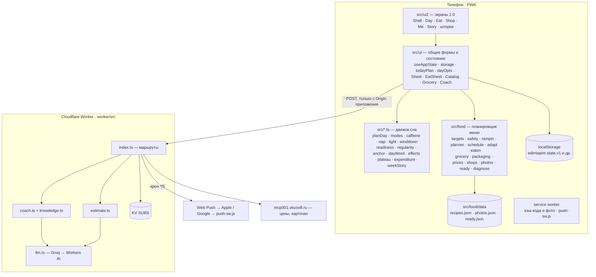

# Как устроен edim & spim

Карта кода для того, кто хочет что-то поправить или понять, почему приложение ведёт себя именно так. Для вопросов «как пользоваться» есть [FAQ](FAQ.md), для истории решений — [LAB.md](../LAB.md).

## Общая картина



Три принципа, которые объясняют большинство решений в коде:

1. **Логика — чистые функции без React и без сети.** Всё, что считает (план дня, меню, расход, слово дня), лежит в `src/*.ts` и `src/food` и покрыто тестами. Экраны только рисуют результат.
2. **Данные только на телефоне.** Сервер получает ровно то, что нужно для одного ответа, и не хранит профиль. Единственное, что лежит на сервере долго — зашифрованная копия и подписка на пуши.
3. **Бесплатные тарифы определяют архитектуру.** KV даёт тысячу записей в сутки на всех, Groq — 8 000 токенов в минуту на модель, Workers AI — 10 000 нейронов в день. Отсюда: копия не чаще раза в три часа и только при изменениях, промпт коуча сжат до ≈3 300 токенов, три модели по очереди, лимит на устройство.

## Папки

| Путь | Что там |
|---|---|
| `src/*.ts` | Движок сна и общие вычисления. Публичный API в `src/index.ts`. |
| `src/food/` | Планировщик меню, покупки, цены, готовая еда. Данные в `src/food/data/`. |
| `src/ui/` | Состояние приложения (`useAppState`, `storage`), расчёт дня для экранов (`todayPlan`, `dayOpts`, `viewModel`, `mealRows`), общие шторки и формы, синхронизация (`cloudSync`, `pairSync`, `notifications`), тема, хаптика, безопасность данных. |
| `src/ui2/` | Экраны 2.0 «Небо»: `Shell` (три вкладки, «?», «+»), `Day`, `Eat`, `Shop`, `Me`, `Story`, шторки `WhySheet`, `PlusSheet`, `AskSheet`, `ReadySheet`, `Install`, `Tour`, `Crash`. Стили в `sky.css`, значки в `icons.ts`. |
| `worker/` | Cloudflare Worker: пуши, коуч, оценка еды, копия, пара, прокси к магазину. |
| `scripts/` | Служебные скрипты: рецепты, цены, фото, готовая еда, аудит планировщика, значки. Черновики рецептов в `scripts/drafts/`. |
| `tests/` | vitest, 74 файла. |
| `docs/` | Спеки и планы (`docs/superpowers/`), скриншоты для README (`docs/screens/`), этот документ, FAQ. |
| `public/` | Иконки, 150 фото блюд (`public/food/`), `push-sw.js`. |
| `LAB.md` | Журнал волн: что, зачем, замеры, грабли, отклонённые идеи. |

## Движок сна (`src/*.ts`)

| Модуль | Отвечает за |
|---|---|
| `types.ts`, `defaults.ts` | Типы профиля, дня, плана; пороги с источниками (отсечки кофеина 9/13 ч, окно сна днём, душ за 90 мин, подготовка за 60). |
| `planDay.ts` | Сборка плана дня из окон: свет, кофеин, сон днём, подготовка ко сну; заметки про алкоголь и режимы. |
| `modes.ts` | Отбой по режиму: обычный, «работаю допоздна» (конец работы + 30 мин), «восстанавливаюсь» (−30 мин), выходные (сдвиг ≤ 60 мин). Признак плохой ночи. |
| `caffeine.ts`, `nap.ts`, `light.ts`, `winddown.ts` | Окна плана с текстом «что делать» и «почему». |
| `readiness.ts`, `regularity.ts`, `anchor.ts` | Длительность сна, ровность подъёма (медиана, от четырёх ночей), разъезд будни/выходные. |
| `dayWord.ts` | Слово дня от оставшихся приёмов и времени до отбоя. |
| `effects.ts` | «Что было вчера?» → личный эффект после 5 «да» и 5 «нет». |
| `streak2.ts` | Серия с двумя заморозками в неделю; цифра пропущенных приёмов на значке. |
| `expenditure.ts` | Реальный расход по линии тренда веса и отметкам еды; предложение поправки. |
| `plateau.ts`, `sleep-food.ts`, `insight.ts`, `weekStory.ts` | Плато, «сон и еда у тебя», итог недели, история недели слайдами. |
| `screener.ts`, `screening.ts` | Скрининги: апноэ, СБН, бессонница, настроение; STOP-Bang и ночное питание. |
| `push.ts` | Какие пуши и когда (с запасом времени), общий код для приложения и воркера. |
| `cloud.ts`, `cloudWords.ts` | Код из четырёх слов, адрес (SHA-256), шифрование (PBKDF2 300k → AES-GCM). |
| `pair.ts` | «Готовим вдвоём» без сети: общее меню, слияние замен, коэффициент покупок. |
| `day-log.ts` | Суточная запись: сон и еда одного дня. Из неё выводится всё остальное. |
| `migrate.ts` | Перенос из pospat и oheedet (форматы разные: у pospat состояние лежит строкой). |
| `today-date.ts`, `time.ts` | Локальная дата (не UTC: в 01:30 ночи «сегодня» — это сегодня), минуты от полуночи, «27:00» = 3 ночи. |

## Планировщик меню (`src/food`)

Конвейер, которым собирается день:

```mermaid
flowchart LR
  T["targets.ts<br>Миффлин × активность − 550"] --> S["safety.ts<br>пол 1200/1500<br>мягче при красных флагах"] --> R["rampin.ts<br>вход в дефицит<br>21 / 14 / 7 / 0 дней"]
  R --> F["planner.filterRecipes<br>аллергены · посуда · бюджет<br>кухни · не люблю · минуты"]
  F --> G["schedule.ts + planner.generateDay<br>по дате, простая половина<br>неделя не повторяет прошлую"]
  G --> K["fitKcal ±3 %<br>balanceFat 20–35 %<br>добор клетчатки заменой"]
  K --> A["adapt.ts<br>плохая ночь → проще,<br>калории те же"]
  A --> M["menuMemory · swaps<br>показанное держится,<br>ручные замены поверх"]
  M --> E["eaten.ts<br>факт против плана,<br>остаток дня ±30 %"]
```



| Модуль | Отвечает за |
|---|---|
| `types.ts` | Рецепт, приём, день, ограничения, цели. |
| `nutrients.ts`, `ingredients.ts` | Справочник продуктов (ккал, белок, жиры, углеводы, клетчатка на 100 г; штучные через средний вес) и пояснения «что именно брать». |
| `targets.ts`, `safety.ts`, `rampin.ts` | Цель, защита, плавный вход. Белок при силовых 1,6 г/кг от веса не выше ИМТ 30. |
| `planner.ts` | Схемы приёмов (2–5), фильтры, сборка дня, подгонка калорий, баланс жиров, добор белка и клетчатки, замены, усилие готовки. |
| `schedule.ts` | Меню, привязанное к календарной дате; фаза недели. |
| `adapt.ts` | Порог плохой ночи, упрощение дня, список «что поменялось». |
| `eaten.ts` | Отметки «съел» / «своё», размер своей еды, еда словами и с этикетки, пересчёт остатка. |
| `diagnose.ts` | Честный диагноз, когда ограничения выели контент («без молока и яиц остался один завтрак»). |
| `grocery.ts`, `packaging.ts` | Список покупок по отделам, скоропорт, фасовки и кладовка. |
| `prices.ts`, `shops.ts` | Цены магазина с датой, стоимость порции, ссылки в семь сервисов доставки. |
| `photos.ts` | Подбор снимка по типу блюда; авторы и лицензии в `photos.json`. |
| `ready.ts` | «День без готовки» из готовой еды: доли приёмов, пары «белок + гарнир», упаковки, на двоих с порциями каждому. |

Правила отбора с замерами (84 дня × 6 профилей, повторы недели, клетчатка) описаны в LAB.md, волны 7, 19, 30, 41, 46, 49, 51–52. Любая правка планировщика: `npx vite-node scripts/audit-planner.ts` до и после.

## Интерфейс (`src/ui2`, `src/ui`)

- **Состояние**: `useAppState` держит `StoredState`, пишет его на диск при каждом действии (`storage.saveState`), отдаёт `actions` (отметить ночь, съел, своё, вес, замена, «ем без плана», «не готовлю», копия, восстановление, «вчера было»).
- **День для экранов**: `todayPlan.ts` собирает еду на дату (меню → память → замены → адаптация к ночи → отметки), `dayOpts.ts` даёт настройки даты (минуты на готовку, на сколько дней готовим), `useDay` в `ui2` склеивает план сна и еду в одну ленту и считает слово дня.
- **Оболочка**: `Shell.tsx` — три вкладки, «Спросить», «+», первый запуск (`Install` на iPhone вне «Домой» → `QuickStart` из трёх шагов), тур, плашка обновления, облачная копия при открытии и сворачивании, пара.
- **Небо**: `sky.ts` даёт градиент по минуте суток и тёмной теме; класс `night` на `<html>` ставится до первого кадра в `main.tsx`, чтобы экран не мигал.
- **Правила вёрстки** (из спеки 2.0): пять размеров шрифта 34/22/17/15/13, одна карточка, карточка в карточке запрещена, стекло только у плавающего, ни одного серого абзаца-пояснения в потоке экрана, «почему» только шторкой, шторка из шторки не открывается, зоны нажатия 44 pt.
- **Обновления**: `main.tsx` проверяет service worker при возврате и раз в час; новая версия применяется молча, если приложение свёрнуто, иначе плашка и перезагрузка после закрытия шторки.

## Хранение

Всё в `localStorage`. Главный ключ `edimispim.state.v1`:

```ts
interface StoredState {
  profile: Profile;                 // подъём, цель сна, хронотип, кофеин, сон днём, цель
  history: DayLog[];                // ночи: дата, подъём, отбой, оценка 1–5, алкоголь
  screener: ScreenerResult | null;
  food?: FoodSettings;              // профиль, ограничения, приёмы, вход, старт, готовка, силовые, поправка
  partner?: FoodProfile;            // партнёр без приложения
  weights?: { date; kg }[];
  eaten?: Record<date, DayEaten>;   // отметки приёмов, размеры, своя еда, калории плана на момент отметки
  ratings?: Record<recipeId, 1 | -1>;
  cheatDays?: string[];
  swaps?: Record<date, Record<slot, recipeId>>;
  menu?: MenuMemory;                // показанное меню
  noCookDays?: string[];
  yesterday?: Record<date, Yesterday>;
}
```

Остальные ключи: `edimispim.day.v1` (черновик режима на сегодня), `edimispim.pantry`, `edimispim.shop`, `edimispim.coach.v1`, `edimispim.cloud` (код и отпечаток копии), `edimispim.pushPrefs`, `edimispim.pushWanted`, `edimispim.vv` (совпадения корзины), `edimispim.theme`, `edimispim.tourSeen`, `edimispim.backupAt`, `edimispim.state.v1.unreadable` (нечитаемое состояние откладывается, а не стирается).

Правила совместимости: новые поля только необязательные; `loadState` проверяет форму и отсеивает битые записи по одной; копия файлом и в облаке содержит все ключи; старые копии открываются.

## Воркер (`worker/src`)

| Маршрут | Что делает | Где хранит |
|---|---|---|
| `POST /subscribe` | Подписка на пуши + профиль сна + режим дня + меню на два дня + переключатели. Отвечает кодом доставки приветственного пуша. ≤ 64 КБ. | KV `sub:<endpoint>` |
| крон `*/5 * * * *` | Для каждой подписки считает `planDay` и `planPushes`/`mealPushes` по местному времени, шлёт, что пора, помнит отправленное за день. | KV `sent:<endpoint>` |
| `POST /backup`, `/restore` | Зашифрованная копия по адресу из кода. Сервер видит только шифр. | KV |
| `POST /pair/put`, `/pair/get` | Меню пары, замены и галочки «взял». | KV |
| `POST /coach` | Поток ответа коуча. Промпт: правила + блок «СЕЙЧАС» из приложения + база знаний (только для вопросов про сон и еду). Groq (три модели по очереди) → Workers AI. Лимит 120 вопросов в день на устройство. | счётчик в KV |
| `POST /estimate` | «Напиши, что съел» и фото тарелки → JSON с позициями, ккал и белком. ≤ 1,5 МБ, JPEG/PNG/WebP. Фото не сохраняется. | — |
| `POST /vv` | Прокси к MCP ВкусВилла для корзины (магазин не отвечает браузеру напрямую). Не чаще раза в секунду. | — |

Все POST только с Origin `https://iserdario-tech.github.io` или localhost. Секреты: `VAPID_PRIVATE`, `GROQ_API_KEY`. Публичный VAPID-ключ в `src/ui/notifications.ts`.

## Сборка и выкатка

- **Vite + vite-plugin-pwa**: `base: /edimispim/`, service worker с `skipWaiting` и `clientsClaim`, фото блюд в runtime-кэш (до 200), рецепты отдельным чанком, чтобы обновление интерфейса не заставляло качать базу заново. Версия сборки `__BUILD__` = дата по Москве + короткий коммит, видна в «Я → О приложении».
- **GitHub Actions** (`.github/workflows/deploy.yml`): на пуш в `main` — `npm ci`, `npm test`, `npm run build`, выкатка на GitHub Pages. Красные тесты не выкатываются.
- **Воркер**: `cd worker && npm run deploy`; `npm run dry` собирает без выкатки.
- **Origin важен**: приложение должно жить на `iserdario-tech.github.io`, иначе не сработает перенос данных из старых приложений и воркер не примет запросы.

## Тесты

`npm test` — vitest, 74 файла, 564 теста, около 10 секунд. Что проверяется помимо обычных юнитов:

- `life-sim.test.ts`: 12 недель выдуманного человека с настоящим расходом ± вода; проверяется, когда и куда приходят поправки нормы.
- `food-real-life`, `food-week-variety`, `food-rebalance`, `food-strength`, `food-sweets`: планировщик на разных профилях и настройках, повторы недели, Б/Ж/У в норме.
- `ready-day.test.ts`: «День без готовки» на заглушке и на живом каталоге: калории ±8 %, белок ≥ 85 %, жиры ≤ 36 %.
- `storage-robust`, `storage-isolation`, `migrate`: мусор в хранилище, двойная сериализация pospat, переполнение.
- `today-date`: локальная дата против UTC за полночь.
- Тесты на формулировки: «связан», а не «приводит»; без процентов и p-значений в наблюдениях; склонения «ночь/ночи/ночей».

## Скрипты

| Скрипт | Зачем | Запуск |
|---|---|---|
| `scripts/add-recipes.ts` | Добавить рецепты из черновика; калории из состава; откажет без нутриентов, цены или пояснения | `npx vite-node scripts/add-recipes.ts scripts/drafts/<файл>.ts [--dry] [--replace]` |
| `scripts/audit-planner.ts` | 12 недель × 8 конфигураций: усилие, минуты, белок, клетчатка, калории, разнообразие | `npx vite-node scripts/audit-planner.ts` |
| `scripts/photo-map.ts` | Какой снимок достался последним 15 рецептам | `npx vite-node scripts/photo-map.ts` |
| `scripts/ready-sample.ts` | Три «дня без готовки» подряд глазами | `npx vite-node scripts/ready-sample.ts` |
| `scripts/fetch-prices.py` | Цены с MCP ВкусВилла → `prices.ts` | `python3 scripts/fetch-prices.py [--write]` |
| `scripts/fetch-ready.py` | Каталог готовой еды → `ready.json` | `python3 scripts/fetch-ready.py` |
| `scripts/vv-recipes.py` | Рецепты ВкусВилла → черновик с сопоставлением продуктов | `python3 scripts/vv-recipes.py fetch <папка> <запросы…>`, затем `map <папка>` |
| `scripts/fetch-photos.py` | Снимки с Викисклада по типу блюда, авторы в `photos.json` | см. шапку скрипта |
| `scripts/gen-icons.py` | Значки Solar → `src/ui2/icons.ts` | `python3 scripts/gen-icons.py` |

## Ограничения, которые нужно знать

| Что | Почему | Где учтено |
|---|---|---|
| Нет вибрации на iPhone | Safari не даёт сайтам Vibration API | `haptics.ts` остаётся для Android, отклик анимацией |
| Пуши на iPhone только с «Домой», iOS 16.4+ | ограничение платформы | экран `Install`, тексты в «Напоминаниях» |
| Safari стирает данные через 7 дней | ITP | `dataSafety.ts`: экран установки, напоминание о копии, `askPersistentStorage()` |
| Коуч ≈250 вопросов в день на всех | бесплатные модели | три модели по очереди, лимит на устройство, база знаний только по теме |
| KV: 1 000 записей в сутки | бесплатный тариф | копия не чаще раза в 3 ч и только при изменениях; счётчик не роняет ответ |
| Цены и ассортимент протухают | магазин | дата снятия рядом с ценой, «без цены» честно |
| Корзина ВкусВилла целиком только на сайте | нет схемы для чужой корзины в приложении | две ссылки, подпись «корзина там та же» |
